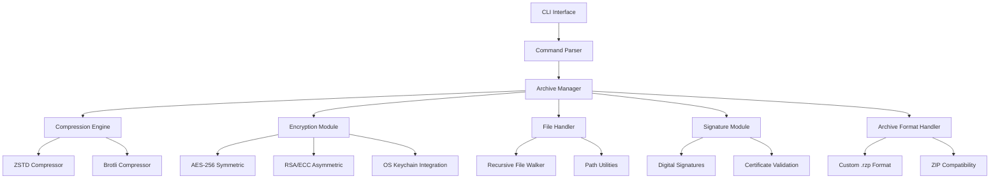

# RuZip - Modern Compression Tool

## Project Overview

**Name:** RuZip  
**Target Audience:** Developers and Power Users  
**Language:** Rust  
**Algorithm:** ZSTD (primary) with optional Brotli support  
**Focus:** Performance, Memory Safety, Modern CLI Experience  

## Core Functions

### Basic Commands (like 7zip)

- `a` - Add files to archive
- `x` - Extract files with full paths
- `e` - Extract files without directory structure
- `l` - List archive contents
- `t` - Test archive integrity
- `d` - Delete files from archive
- `u` - Update files in archive

### Advanced Features

- **Password Protection:** AES-256 symmetric encryption
- **Asymmetric Encryption:** RSA/ECC encryption with OS keychain integration
- **Digital Signatures:** RSA/EdDSA signing for authenticity verification
- **Compression Levels:** `-mx1` (fast) to `-mx22` (ultra, ZSTD-specific)
- **Recursion:** `-r` for subdirectories
- **Multi-Threading:** `-mmt[N]` for parallel compression
- **Progress Display:** Modern CLI progress bar

## Architecture Design



## Project Structure

```
ruzip/
├── Cargo.toml
├── README.md
├── LICENSE
├── .github/
│   └── workflows/
│       ├── ci.yml
│       ├── release.yml
│       └── security.yml
├── src/
│   ├── main.rs
│   ├── lib.rs
│   ├── cli/
│   │   ├── mod.rs
│   │   ├── parser.rs
│   │   ├── commands.rs
│   │   └── completion.rs
│   ├── archive/
│   │   ├── mod.rs
│   │   ├── manager.rs
│   │   ├── format.rs
│   │   ├── metadata.rs
│   │   └── validation.rs
│   ├── compression/
│   │   ├── mod.rs
│   │   ├── zstd.rs
│   │   ├── brotli.rs
│   │   ├── traits.rs
│   │   └── stream.rs
│   ├── encryption/
│   │   ├── mod.rs
│   │   ├── aes.rs
│   │   ├── asymmetric.rs
│   │   ├── rsa.rs
│   │   ├── ecc.rs
│   │   ├── keychain.rs
│   │   ├── key_derivation.rs
│   │   └── password.rs
│   ├── signature/
│   │   ├── mod.rs
│   │   ├── rsa_sign.rs
│   │   ├── eddsa.rs
│   │   ├── verify.rs
│   │   └── certificates.rs
│   ├── io/
│   │   ├── mod.rs
│   │   ├── file_walker.rs
│   │   ├── progress.rs
│   │   ├── streams.rs
│   │   └── permissions.rs
│   └── utils/
│       ├── mod.rs
│       ├── error.rs
│       ├── config.rs
│       └── logging.rs
├── tests/
│   ├── integration/
│   │   ├── basic_operations.rs
│   │   ├── compression_tests.rs
│   │   ├── encryption_tests.rs
│   │   └── performance_tests.rs
│   └── unit/
├── benches/
│   ├── compression_bench.rs
│   ├── encryption_bench.rs
│   └── io_bench.rs
├── docs/
│   ├── blueprint.md
│   ├── api.md
│   ├── security.md
│   └── performance.md
└── examples/
    ├── basic_usage.rs
    ├── custom_compression.rs
    └── batch_operations.rs
```

## Technical Specifications

### Dependencies (Cargo.toml)

```toml
[package]
name = "ruzip"
version = "0.1.0"
edition = "2021"
authors = ["Your Name <your.email@example.com>"]
description = "A modern, fast, and secure compression tool"
homepage = "https://github.com/user/ruzip"
repository = "https://github.com/user/ruzip"
license = "MIT OR Apache-2.0"
keywords = ["compression", "archive", "zstd", "encryption"]
categories = ["compression", "command-line-utilities"]

[dependencies]
# CLI and user interface
clap = { version = "4.0", features = ["derive", "color"] }
indicatif = "0.17"         # Progress bars
console = "0.15"           # Terminal utilities

# Compression algorithms
zstd = "0.13"              # ZSTD compression
brotli = "3.4"             # Brotli compression  

# Cryptography
aes-gcm = "0.10"           # AES-256-GCM encryption
argon2 = "0.5"             # Key derivation
rand = "0.8"               # Cryptographic randomness
zeroize = "1.6"            # Secure memory clearing

# Asymmetric cryptography and signatures
rsa = "0.9"                # RSA encryption/decryption
ed25519-dalek = "2.0"      # EdDSA signatures
p256 = "0.13"              # ECDSA P-256 curve
ring = "0.17"              # Additional crypto primitives
pkcs8 = "0.10"             # PKCS#8 key handling
x509-parser = "0.15"       # X.509 certificate parsing

# OS-specific keychain/keystore integration
[target.'cfg(target_os = "macos")'.dependencies]
security-framework = "2.9" # macOS Keychain access

[target.'cfg(target_os = "windows")'.dependencies]
windows = { version = "0.51", features = ["Win32_Security_Cryptography"] }

[target.'cfg(target_os = "linux")'.dependencies]
secret-service = "3.0"     # Linux Secret Service API (GNOME Keyring)

# File system operations
walkdir = "2.4"            # Recursive directory walking
filetime = "0.2"           # File timestamp handling
libc = "0.2"               # System permissions (Unix)

# Serialization and data handling
serde = { version = "1.0", features = ["derive"] }
bincode = "1.3"            # Binary serialization
uuid = { version = "1.0", features = ["v4"] }

# Parallelization and async
rayon = "1.7"              # Data parallelism
tokio = { version = "1.0", features = ["full"], optional = true }

# Error handling and logging
anyhow = "1.0"             # Error handling
thiserror = "1.0"          # Custom error types
tracing = "0.1"            # Structured logging
tracing-subscriber = { version = "0.3", features = ["env-filter"] }

# Hashing and integrity
crc32fast = "1.3"          # CRC32 checksums
sha2 = "0.10"              # SHA-256 for integrity verification

# Configuration and environment
dirs = "5.0"               # Standard directories
toml = "0.8"               # Configuration files

[dev-dependencies]
criterion = { version = "0.5", features = ["html_reports"] }
tempfile = "3.8"
proptest = "1.0"
assert_cmd = "2.0"
predicates = "3.0"

[features]
default = ["progress", "encryption", "asymmetric-crypto"]
progress = ["indicatif"]
encryption = ["aes-gcm", "argon2", "rand", "zeroize"]
asymmetric-crypto = ["rsa", "ed25519-dalek", "p256", "ring", "pkcs8", "x509-parser"]
keychain-integration = ["security-framework", "windows", "secret-service"]
async = ["tokio"]
brotli-support = ["brotli"]

[[bin]]
name = "ruzip"
path = "src/main.rs"

[[bench]]
name = "compression"
harness = false
```

### Command Line Interface

```bash
# Basic syntax
ruzip <command> [options] <archive> [files...]

# Examples
ruzip a -mx9 -p myarchive.rzp file1.txt dir/
ruzip x -o output/ myarchive.rzp
ruzip l -slt myarchive.rzp
ruzip a -r -mmt4 backup.rzp ~/Documents/
```

### Supported Commands and Options

#### Commands

- `a` - Add files to archive
- `d` - Delete files from archive
- `e` - Extract files from archive (without using directory names)
- `l` - List contents of archive
- `t` - Test integrity of archive
- `u` - Update files to archive
- `x` - eXtract files with full paths

#### Important Switches

- `-mx[N]` - Compression level: -mx1 (fastest) ... -mx22 (ultra)
- `-mmt[N]` - Number of CPU threads
- `-o{Directory}` - Set output directory
- `-p{Password}` - Set password
- `-r[-|0]` - Recursive subdirectories
- `-t{Type}` - Set archive type
- `-v{Size}[b|k|m|g]` - Split archive into volumes
- `-x[r[-|0]]{@listfile|!wildcard}` - Exclude files
- `-y` - Yes to all questions
- `--progress` - Show progress bar
- `--json` - JSON output format
- `--dry-run` - Preview without execution
- `--preserve-permissions` - Maintain file permissions
- `--verify` - Verify archive after creation
- `--encrypt-key <pubkey>` - Encrypt with public key (RSA/ECC)
- `--decrypt-key <privkey>` - Decrypt with private key
- `--sign-key <privkey>` - Sign archive with private key
- `--verify-signature <pubkey>` - Verify signature with public key
- `--keychain` - Use OS keychain for key management
- `--cert <certificate>` - Use X.509 certificate for verification

## Implementation Plan

### Phase 1: Foundation (Week 1-2)

1. Project setup with Cargo
2. CLI parser implementation with clap
3. Basic error handling with anyhow/thiserror
4. Simple file I/O operations
5. Unit tests for core functionality
6. Logging infrastructure setup

### Phase 2: Compression (Week 3-4)

1. ZSTD integration and streaming
2. Archive format definition and implementation
3. Single file compression/decompression
4. Basic archive creation and extraction
5. Benchmark tests and performance baseline
6. Memory-efficient large file handling

### Phase 3: Advanced Features (Week 5-6)

1. Recursive directory handling with proper metadata
2. Multi-threading support with rayon
3. Progress indicators and user feedback
4. Archive listing and integrity testing
5. Update/delete operations in archives
6. File permission and timestamp preservation

### Phase 4: Security (Week 7-8)

1. AES-256-GCM symmetric encryption implementation
2. RSA/ECC asymmetric encryption support
3. Digital signature implementation (RSA-PSS, ECDSA, EdDSA)
4. OS keychain integration (macOS Keychain, Windows Certificate Store, Linux Secret Service)
5. X.509 certificate handling and validation
6. Secure key derivation with Argon2
7. Password input without echo
8. Integrity checks with SHA-256
9. Security testing and vulnerability assessment
10. Secure memory handling with zeroize

### Phase 5: Optimization & Polish (Week 9-10)

1. Performance optimizations and profiling
2. Memory efficiency improvements
3. Brotli integration (optional)
4. ZIP format compatibility (optional)
5. Comprehensive testing and documentation
6. Shell completion generation

### Phase 6: Production Ready (Week 11-12)

1. Cross-platform testing and fixes
2. Release automation and packaging
3. Documentation and user guides
4. Performance benchmarking against competitors
5. Security audit and code review
6. Community feedback integration

## Performance Goals

- **Compression Speed:** At least as fast as 7zip
- **Memory Usage:** Maximum 512MB for archives up to 10GB
- **Multi-Threading:** Scaling up to 16 CPU cores
- **Startup Time:** Under 50ms for simple operations
- **Large File Support:** Efficient handling of files >4GB
- **Concurrent Operations:** Support multiple parallel archive operations

## Special Features for Power Users

1. **JSON Output:** `--json` for machine-readable output
2. **Batch Operations:** Support for list files and batch processing
3. **Dry Run:** `--dry-run` for preview without execution
4. **Verbose Modes:** Detailed logging options with tracing
5. **Shell Integration:** Completion for bash/zsh/fish
6. **Configuration Files:** User and system-wide config support
7. **Plugin Architecture:** Extensible compression algorithms
8. **Streaming Support:** Process archives without full loading
9. **Metadata Preservation:** Extended attributes, ACLs, timestamps
10. **Network Support:** Direct archive creation from URLs (future)
11. **Asymmetric Encryption:** RSA/ECC encryption with public key cryptography
12. **Digital Signatures:** RSA-PSS, ECDSA, EdDSA signature support
13. **OS Keychain Integration:** Native keystore support (macOS/Windows/Linux)
14. **X.509 Certificate Support:** Enterprise PKI integration
15. **Hardware Security Module (HSM) Support:** Future enterprise feature

## Archive Format (.rzp)

### Header Structure

```plaintext
Magic Number: "RUZIP" (4 bytes)
Version: u16 (2 bytes)
Flags: u32 (4 bytes)
- Bit 0: Encrypted (symmetric)
- Bit 1: Asymmetric encrypted
- Bit 2: Digitally signed
- Bit 3: Has X.509 certificates
- Bit 4: Compressed
- Bit 5: Multi-volume
- Bit 6: Has SHA-256 checksums
- Bit 7: Preserves permissions
- Bit 8: Has extended attributes
Entry Count: u64 (8 bytes)
Header Checksum: u32 (4 bytes)
Crypto Info Offset: u64 (8 bytes)  # Offset to cryptographic metadata
Reserved: [u8; 4] (4 bytes)
```

### Cryptographic Metadata Section (if Bit 1, 2, or 3 set)

```plaintext
Crypto Section Header:
- Section Length: u32
- Asymmetric Algorithm: u8 (1=RSA-2048, 2=RSA-4096, 3=ECC-P256, 4=ECC-P384)
- Signature Algorithm: u8 (1=RSA-PSS, 2=ECDSA, 3=EdDSA, 0=None)
- Key Derivation: u8 (1=PBKDF2, 2=Argon2id, 3=scrypt, 0=None)

If Asymmetric Encrypted (Bit 1):
- Encrypted Key Length: u16
- Encrypted Symmetric Key: [u8; N] (encrypted AES key)
- Public Key Fingerprint: [u8; 32] (SHA-256 of public key)

If Digitally Signed (Bit 2):
- Signature Length: u16
- Archive Signature: [u8; N] (signature of archive content)
- Signer Public Key Length: u16
- Signer Public Key: [u8; N] (DER encoded public key)
- Certificate Chain Length: u16 (optional)
- Certificate Chain: [u8; N] (X.509 certificates, optional)
```

### Entry Structure

```plaintext
Entry Header:
- File Path Length: u32
- File Path: UTF-8 string
- Original Size: u64
- Compressed Size: u64
- CRC32: u32
- SHA-256: [u8; 32] (optional)
- Modification Time: u64
- Access Time: u64 (optional)
- Creation Time: u64 (optional)
- File Mode: u32 (Unix permissions)
- Compression Method: u8
- Encryption Method: u8
- Data Offset: u64
- Flags: u32
  - Bit 0: Is directory
  - Bit 1: Is symlink
  - Bit 2: Has extended attributes
  - Bit 3: Is executable
```

### Extended Attributes (Optional)

```plaintext
XAttr Count: u16
For each XAttr:
- Name Length: u16
- Name: UTF-8 string
- Value Length: u32
- Value: bytes
```

## Quality Assurance

### Testing Strategy

- **Unit Tests:** Minimum 85% code coverage
- **Integration Tests:** Complete CLI scenarios
- **Property Tests:** Using proptest for edge cases
- **Benchmark Tests:** Performance regression prevention
- **Security Tests:** Cryptographic security validation
- **Fuzzing:** Input validation and crash prevention
- **Cross-Platform:** Linux, macOS, Windows, FreeBSD

### Continuous Integration

```yaml
# .github/workflows/ci.yml example
name: CI
on: [push, pull_request]
jobs:
  test:
    strategy:
      matrix:
        os: [ubuntu-latest, windows-latest, macos-latest]
        rust: [stable, beta, nightly]
    runs-on: ${{ matrix.os }}
    steps:
      - uses: actions/checkout@v3
      - uses: actions-rs/toolchain@v1
        with:
          toolchain: ${{ matrix.rust }}
          components: rustfmt, clippy
      - run: cargo test --all-features
      - run: cargo clippy -- -D warnings
      - run: cargo fmt --check
```

### Security Considerations

- Regular security audits using `cargo audit`
- Dependency vulnerability scanning
- Memory safety verification
- Cryptographic implementation review
- Input sanitization and validation
- Secure defaults for all operations

## Example Usage

### Basic Operations

```bash
# Create archive
ruzip a documents.rzp ~/Documents/ -r

# With compression and password
ruzip a -mx9 -p secure.rzp sensitive_files/ -r

# Extract with progress
ruzip x documents.rzp -o ~/restore/ --progress

# List contents with details
ruzip l documents.rzp --verbose

# Test integrity
ruzip t documents.rzp --verify

# Multi-threaded compression
ruzip a -mmt8 -mx5 large_archive.rzp /large/directory/ -r
```

### Advanced Options

```bash
# Exclude specific files and directories
ruzip a backup.rzp ~/project/ -r -x"*.tmp" -x"node_modules/" -x".git/"

# Progress display with JSON output
ruzip a --progress --json backup.rzp ~/data/ -r

# Dry run for preview
ruzip a --dry-run backup.rzp ~/data/ -r

# Different compression levels
ruzip a -mx1 fast.rzp ~/temp/     # Fast
ruzip a -mx22 ultra.rzp ~/docs/   # Maximum compression

# Preserve all metadata
ruzip a --preserve-permissions --preserve-timestamps backup.rzp ~/important/ -r

# Create encrypted archive with verification
ruzip a -p -mx9 --verify secure.rzp ~/confidential/ -r

# Asymmetric encryption with public key
ruzip a --encrypt-key ./recipient.pub -mx9 secure.rzp ~/confidential/ -r

# Create signed archive
ruzip a --sign-key ./my-private.key -mx9 signed.rzp ~/important/ -r

# Create archive with both encryption and signature
ruzip a --encrypt-key ./recipient.pub --sign-key ./my-private.key archive.rzp ~/data/ -r

# Extract and verify signature
ruzip x --verify-signature ./sender.pub archive.rzp -o ~/extracted/

# Use OS keychain for key management (macOS)
ruzip a --keychain --encrypt-key "John Doe's Public Key" secure.rzp ~/data/ -r

# Extract with keychain integration
ruzip x --keychain secure.rzp -o ~/extracted/

# Verify using X.509 certificate
ruzip x --cert ./ca-cert.pem --verify-signature signed.rzp -o ~/verified/
```

### Configuration File Example

```toml
# ~/.config/ruzip/config.toml
[default]
compression_level = 9
threads = 0  # Auto-detect
preserve_permissions = true
preserve_timestamps = true
progress_bar = true

[security]
default_encryption = "aes256"
asymmetric_algorithm = "rsa4096"  # rsa2048, rsa4096, ecc-p256, ecc-p384
signature_algorithm = "rsa-pss"   # rsa-pss, ecdsa, eddsa
key_derivation_rounds = 100000
secure_delete = true
use_keychain = true               # Enable OS keychain integration

[keychain]
# macOS Keychain settings
keychain_name = "login"
key_label_prefix = "ruzip-"

# Windows Certificate Store settings
store_location = "CurrentUser"    # CurrentUser, LocalMachine
store_name = "My"                 # My, Root, TrustedPeople

# Linux Secret Service settings
collection = "default"

[certificates]
verify_chain = true
require_valid_cert = false       # Set to true for strict validation
trusted_ca_file = "~/.config/ruzip/trusted-cas.pem"

[output]
json_format = false
verbose_level = "info"
color_output = true
```

## Roadmap

### Version 1.0 (MVP)

- Basic compression and extraction
- ZSTD support with all compression levels
- Password protection with AES-256
- CLI interface with progress bars
- Cross-platform support
- Basic integrity checking

### Version 1.1 (Enhanced)

- Multi-threading optimizations
- Shell completion support
- Configuration file support
- Extended logging and debugging
- Performance improvements
- Better error messages

### Version 1.2 (Advanced)

- Brotli compression support
- ZIP format compatibility (read-only)
- JSON output format
- Batch operation support
- Plugin architecture foundation
- Advanced metadata preservation

### Version 1.3 (Professional)

- Streaming archive processing
- Network archive support (HTTP/S)
- Archive splitting and merging
- Incremental backups
- Archive repair capabilities
- Enterprise features

### Version 2.0 (Next Generation)

- GUI interface (optional)
- Cloud storage integration
- Advanced encryption algorithms
- Archive deduplication
- Version control integration
- API and library support

## Installation and Build

### From Source

```bash
# Clone repository
git clone https://github.com/user/ruzip
cd ruzip

# Development build
cargo build

# Release build
cargo build --release

# Run tests
cargo test --all-features

# Run benchmarks
cargo bench

# Install locally
cargo install --path .

# Install from crates.io (future)
cargo install ruzip
```

### Package Managers (Future)

```bash
# Homebrew (macOS/Linux)
brew install ruzip

# Chocolatey (Windows)
choco install ruzip

# Scoop (Windows)
scoop install ruzip

# APT (Debian/Ubuntu)
apt install ruzip

# Pacman (Arch Linux)
pacman -S ruzip
```

## Documentation

### API Documentation

- Complete rustdoc documentation
- Usage examples for all modules
- Performance characteristics
- Safety guarantees

### User Documentation

- Comprehensive user manual
- Tutorial for beginners
- Advanced usage scenarios
- Troubleshooting guide
- Performance tuning tips

### Developer Documentation

- Architecture overview
- Contribution guidelines
- Testing procedures
- Release process
- Security considerations

## License

GPLv3 or later

## Contributing

1. Fork the repository
2. Create a feature branch
3. Make your changes with tests
4. Ensure all tests pass
5. Submit a pull request

See [CONTRIBUTING.md](CONTRIBUTING.md) for detailed guidelines.

## Missing Elements Analysis

The original blueprint was comprehensive, but several important elements were missing or could be enhanced:

### Critical Missing Elements

1. **Logging Framework:** Added tracing for structured logging
2. **Extended Testing Strategy:** Property testing, fuzzing, cross-platform CI
3. **Security Considerations:** Memory safety, secure defaults, audit procedures
4. **Metadata Preservation:** File permissions, timestamps, extended attributes
5. **Configuration Management:** User/system config files
6. **Large File Handling:** Streaming support for >4GB files
7. **Release Strategy:** Packaging, distribution, versioning
8. **Documentation Structure:** API docs, user guides, developer docs
9. **Symbolic Link Support:** Proper handling of symlinks and special files
10. **Error Recovery:** Archive repair and validation capabilities

### Enhanced Elements

1. **More Comprehensive Dependencies:** Added security, logging, and utility crates
2. **Extended Project Structure:** CI/CD, examples, documentation directories
3. **Detailed Archive Format:** More metadata, extensibility, validation
4. **Advanced CLI Options:** More granular control, modern UX features
5. **Performance Considerations:** Memory efficiency, streaming, concurrency
6. **Security Hardening:** Secure memory handling, cryptographic best practices

This enhanced blueprint provides a more production-ready foundation for building a professional compression tool that can compete with existing solutions.
