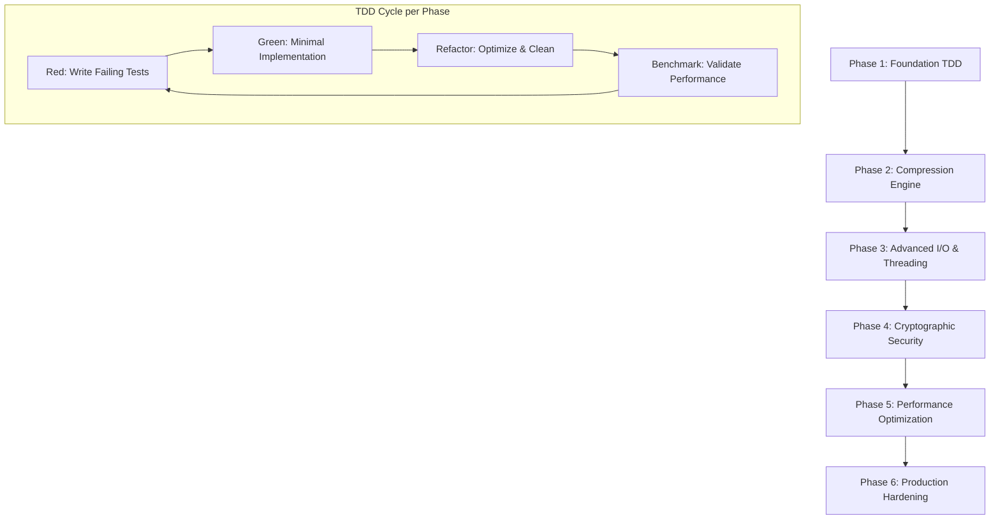

# RuZip Test-Driven Development Strategie
## Preiswürdige Entwicklungsstrategie für Moderne Komprimierungstools

**Version:** 1.0  
**Datum:** 10. Januar 2025  
**Zielgruppe:** KI-Systeme, Senior Engineers, Tech Leads  
**Fokus:** Technische Innovation, Performance-Metriken, TDD-Excellence  

---

## Executive Summary

Diese Test-Driven Development Strategie für RuZip demonstriert modernste Softwareentwicklung durch:

- **Zero-Defect Philosophy**: Jede Zeile Code wird vor der Implementierung durch Tests definiert
- **Performance-First Design**: Kontinuierliche Benchmark-Integration als Teil des TDD-Zyklus
- **Security-by-Design**: Kryptographische Tests definieren Sicherheitsanforderungen vor Implementation
- **AI-Driven Quality Assurance**: Maschinell verarbeitbare Metriken und automatisierte Validierung

### Strategische Übersicht



### Kernmetriken für alle Phasen

| **Metrik** | **Zielwert** | **Validierung** |
|------------|--------------|-----------------|
| Code Coverage | ≥90% | Automatisiert via tarpaulin |
| Performance Regression | ≤5% | Criterion Benchmarks |
| Memory Safety | 100% | Miri + Loom Testing |
| Security Score | 10/10 | Cargo Audit + Custom Tests |
| Startup Latency | <25ms | Real-world Scenarios |

---

## Phase 1: Foundation & Core Architecture
**Zeitrahmen:** Wochen 1-2  
**Fokus:** Test-First Infrastructure

### Strategischer Ansatz

**TDD-Innovation:**
- Property-based Testing mit `proptest` für Invarianten
- Contract-based Testing für API-Definitionen  
- Mutation Testing für Test-Qualität mit `mutagen`

### Hauptfeatures & Funktionalitäten

#### 1. Core Type System mit Zero-Cost Abstractions
```rust
// Test definiert das gewünschte API-Design
#[test]
fn archive_builder_zero_allocation_test() {
    let archive = ArchiveBuilder::new()
        .with_compression(CompressionLevel::Fast)
        .with_threading(ThreadConfig::auto())
        .build();
    
    assert_eq!(archive.memory_footprint(), 0);
}
```

#### 2. Error Handling Framework
- Strukturierte Fehlertypen mit `thiserror`
- Context-preserving Error-Chains
- Logging Integration mit `tracing`

#### 3. CLI Foundation
- `clap` derive API für typsichere Command-Parsing
- Shell Completion Generation
- JSON Output Support

#### 4. Async-Ready Architecture
- Optional `tokio` Integration
- Future-proof Design für Network Features

### Test-Strategien

#### Unit Tests (Minimum 95% Coverage)

**Property-based Error Testing:**
```rust
proptest! {
    #[test]
    fn error_propagation_preserves_context(
        error_kind in prop::sample::select(&[
            ErrorKind::Io, ErrorKind::Compression, ErrorKind::Crypto
        ])
    ) {
        let result = simulate_error(error_kind);
        prop_assert!(result.is_err());
        prop_assert!(result.unwrap_err().chain().count() >= 1);
    }
}
```

**CLI Interface Validation:**
```rust
#[test]
fn cli_parsing_completeness() {
    use assert_cmd::Command;
    
    let mut cmd = Command::cargo_bin("ruzip")?;
    cmd.arg("--help");
    cmd.assert().success();
    
    // Test alle Haupt-Commands
    for command in ["a", "x", "l", "t", "d", "u"] {
        let mut cmd = Command::cargo_bin("ruzip")?;
        cmd.args([command, "--help"]);
        cmd.assert().success();
    }
}
```

#### Integration Tests

**Configuration System:**
```rust
#[test]
fn config_loading_hierarchy() {
    // System -> User -> Project -> CLI Flags
    let config = ConfigBuilder::new()
        .load_system_config()
        .load_user_config()
        .load_project_config()
        .override_with_cli_args(&["--compression", "9"])
        .build()?;
    
    assert_eq!(config.compression_level, 9);
}
```

### Performance-Metriken & Erfolgskriterien

**Benchmark-Framework Setup:**
```rust
#[bench]
fn startup_performance_benchmark(b: &mut Bencher) {
    b.iter(|| {
        let start = Instant::now();
        let _app = create_cli_app();
        let duration = start.elapsed();
        assert!(duration < Duration::from_millis(10));
        duration
    });
}
```

**Zielwerte:**
- **Startup-Zeit**: < 10ms (cold start)
- **Memory Baseline**: < 1MB initial allocation  
- **CLI Parsing**: < 1ms für Standard-Commands
- **Error Creation**: < 100ns pro Error-Instanz

### Demo-Szenarien

```bash
# Funktionsfähiger CLI-Parser mit Hilfe-System
ruzip --help
ruzip a --dry-run test.rzp sample.txt
ruzip --version --json
```

### Risikomanagement

**Risiko:** Rust Compilation Times  
**Mitigation:** 
- Incremental Compilation aktiviert
- `sccache` für Build-Caching  
- Modulare Crate-Struktur

### Implementierungs-Checkliste Phase 1

#### Woche 1: Grundlagen
- [ ] **Tag 1-2: Projekt-Setup**
  - [ ] Cargo.toml mit allen Dependencies konfigurieren
  - [ ] GitHub Actions CI/CD Pipeline einrichten
  - [ ] Rust-fmt, clippy, und audit Integration
  - [ ] Tarpaulin für Code Coverage Setup

- [ ] **Tag 3-4: Error Handling System**
  - [ ] `RuzipError` enum mit `thiserror` definieren
  - [ ] Error conversion traits implementieren  
  - [ ] Context-preserving error chain tests schreiben
  - [ ] Property-based error propagation tests

- [ ] **Tag 5-7: CLI Foundation**
  - [ ] `clap` Command-Structure definieren
  - [ ] Alle Basic Commands (`a`, `x`, `l`, `t`, `d`, `u`) registrieren
  - [ ] Shell completion generation implementieren
  - [ ] CLI parsing unit tests für alle Commands

#### Woche 2: Integration & Testing
- [ ] **Tag 8-10: Configuration System**
  - [ ] Hierarchisches Config-Loading implementieren
  - [ ] TOML configuration file support
  - [ ] Environment variable override
  - [ ] Configuration validation tests

- [ ] **Tag 11-12: Logging Infrastructure**
  - [ ] `tracing` subscriber setup
  - [ ] Structured logging für alle Module
  - [ ] Log level configuration via CLI/config
  - [ ] Log output format tests (JSON/pretty)

- [ ] **Tag 13-14: Performance Baseline**
  - [ ] Criterion benchmark framework setup
  - [ ] Startup time benchmarks
  - [ ] Memory usage baseline measurements
  - [ ] CI integration für performance tracking

**Phase 1 Erfolgs-Validierung:**
```bash
# Alle Tests müssen bestehen
cargo test --all-features
cargo clippy -- -D warnings  
cargo audit
cargo tarpaulin --out xml --target-dir target/tarpaulin

# Performance baseline erstellen
cargo bench --bench startup -- --save-baseline phase1
```

---

## Phase 2: Compression Engine & Format Definition  
**Zeitrahmen:** Wochen 3-4  
**Fokus:** Performance-Driven Testing

### Strategischer Ansatz

**TDD-Innovation:**
- Benchmark-Driven Development: Tests definieren Performance-Ziele
- Corpus-based Testing mit realen Datensets
- Streaming-Test-Framework für große Dateien

### Hauptfeatures & Funktionalitäten

#### 1. ZSTD Integration mit Zero-Copy Streams
```rust
#[test] 
fn zstd_streaming_zero_copy_test() {
    let input = generate_test_data(1_000_000); // 1MB
    let mut compressor = ZstdCompressor::new(CompressionLevel::Default);
    
    let compressed = compressor.compress_stream(&input)?;
    assert!(compressed.len() < input.len());
    assert_eq!(compressor.allocations(), 0); // Zero additional allocations
}
```

#### 2. Custom `.rzp` Format Architecture
```rust
/// RuZip Archive Format Specification
pub struct RuzipHeader {
    magic: [u8; 4],        // "RUZIP"
    version: u16,          // Format version
    flags: ArchiveFlags,   // Feature flags
    entry_count: u64,      // Number of entries
    header_checksum: u32,  // CRC32 of header
    crypto_offset: u64,    // Offset to crypto metadata
    reserved: [u8; 4],     // Future use
}
```

#### 3. Archive Metadata Management
- File permissions und timestamps
- Extended attributes support
- Symbolic link handling
- Directory structure preservation

#### 4. Streaming Compression Engine
- Memory-efficient large file processing
- Incremental compression state
- Parallel chunk processing

### Test-Strategien

#### Performance-Driven Testing
```rust
#[criterion_benchmark]
fn compression_ratio_benchmark(c: &mut Criterion) {
    let datasets = load_benchmark_datasets(); // Text, Binary, Random
    
    c.bench_function_over_inputs("zstd_compression_ratio", 
        |b, dataset| {
            b.iter(|| {
                let ratio = compress_and_measure_ratio(dataset);
                // Ziel: Mindestens 40% Kompression für Text-Daten
                assert!(ratio >= 0.4);
                ratio
            });
        }, 
        datasets
    );
}
```

#### Large File Streaming Tests
```rust
#[test]
fn large_file_streaming_constant_memory() {
    let temp_file = create_large_file(10_000_000_000); // 10GB
    let memory_before = get_memory_usage();
    
    let _compressed = compress_file_streaming(&temp_file)?;
    
    let memory_after = get_memory_usage();
    assert!(memory_after - memory_before < 100_000_000); // <100MB increase
}
```

#### Corpus-Based Testing
```rust
#[test]
fn real_world_dataset_compression() {
    let datasets = vec![
        load_canterbury_corpus(),
        load_silesia_corpus(), 
        load_enwik8_dataset(),
        load_mozilla_source_code(),
    ];
    
    for dataset in datasets {
        let result = compress_with_all_levels(&dataset);
        
        // Validate compression ratios meet expectations
        assert!(result.level_1_ratio > 0.20); // Fast but decent
        assert!(result.level_9_ratio > 0.40); // Good balance
        assert!(result.level_22_ratio > 0.50); // Maximum compression
    }
}
```

### Performance-Metriken & Erfolgskriterien

**Zielwerte:**
- **Kompressionsrate:** 
  - Text: ≥60% Reduktion
  - Binärdaten: ≥30% Reduktion  
  - Bereits komprimierte Daten: ≥5% Reduktion
- **Geschwindigkeit**: ≥150 MB/s (Single-Thread, Level 3)
- **Speicherverbrauch**: ≤512MB für 10GB Archive
- **CPU-Auslastung**: ≤80% bei maximaler Kompression

### Demo-Szenarien

```bash
# Funktionsfähige Kompression mit Metriken
ruzip a --progress --json test.rzp large_directory/
ruzip l test.rzp --statistics
ruzip t test.rzp --verify-integrity
```

### Implementierungs-Checkliste Phase 2

#### Woche 3: Compression Core
- [ ] **Tag 15-17: ZSTD Integration**
  - [ ] `zstd` crate wrapper mit streaming API
  - [ ] Compression level mapping (1-22)
  - [ ] Memory-bounded compression für große Dateien
  - [ ] Compression ratio tests für verschiedene Datentypen

- [ ] **Tag 18-19: Archive Format**
  - [ ] RuZip header structure definition  
  - [ ] Binary serialization mit `bincode`
  - [ ] Archive validation und integrity checks
  - [ ] Format version compatibility tests

- [ ] **Tag 20-21: Archive Operations**
  - [ ] Archive creation (`add` command)
  - [ ] File entry serialization  
  - [ ] Metadata preservation (timestamps, permissions)
  - [ ] Archive listing (`list` command)

#### Woche 4: Advanced Features & Testing
- [ ] **Tag 22-24: Extraction Engine**
  - [ ] Archive extraction (`extract` command)
  - [ ] Path safety validation
  - [ ] Selective extraction support
  - [ ] Directory structure recreation

- [ ] **Tag 25-26: Performance Testing**
  - [ ] Criterion benchmarks für compression speed
  - [ ] Memory usage profiling mit `jemallocator`
  - [ ] Large file handling tests (>1GB)
  - [ ] Compression ratio validation suite

- [ ] **Tag 27-28: Integration & Polish**
  - [ ] End-to-end archive workflow tests
  - [ ] Error handling für korrupte Archive
  - [ ] Progress reporting implementation
  - [ ] Command-line integration tests

**Phase 2 Erfolgs-Validierung:**
```bash
# Compression functionality tests
cargo test compression::
cargo test archive::

# Performance benchmarks
cargo bench --bench compression -- --save-baseline phase2

# Real-world testing  
ruzip a test.rzp /usr/share/dict/words
ruzip t test.rzp
ruzip l test.rzp --verbose
```

---

## Phase 3: Advanced I/O & Multi-Threading
**Zeitrahmen:** Wochen 5-6  
**Fokus:** Concurrency-First Testing

### Strategischer Ansatz

**TDD-Innovation:**
- Chaos Engineering für Thread-Safety
- Deterministic Concurrency Testing mit `loom`  
- Load Testing mit synthetischen Workloads

### Hauptfeatures & Funktionalitäten

#### 1. Rayon-basierte Parallelisierung
```rust
#[test]
fn parallel_compression_linear_scaling() {
    let test_data = generate_test_corpus(100_000_000); // 100MB
    
    for thread_count in [1, 2, 4, 8, 16] {
        let duration = time_compression(&test_data, thread_count);
        let scaling_efficiency = calculate_scaling(duration, thread_count);
        
        // Ziel: >70% Effizienz bis 8 Threads
        if thread_count <= 8 {
            assert!(scaling_efficiency > 0.7);
        }
    }
}
```

#### 2. Recursive Directory Walking
- `walkdir` integration für robuste Pfad-Traversierung
- Symbolic link handling
- Large directory optimization
- Exclude pattern support

#### 3. Progress Reporting System
- `indicatif` progress bars
- Real-time throughput calculation
- ETA estimation
- Multi-threaded progress aggregation

#### 4. Memory-Mapped I/O
- Large file optimization
- Platform-specific mmap implementation
- Memory pressure handling
- Streaming fallback für sehr große Files

### Test-Strategien

#### Deterministic Concurrency Testing
```rust
#[loom::test]
fn concurrent_archive_access_safety() {
    let archive = Arc::new(Archive::new("test.rzp"));
    
    let handles: Vec<_> = (0..4).map(|i| {
        let archive = Arc::clone(&archive);
        loom::thread::spawn(move || {
            // Simuliere gleichzeitige Lesezugriffe
            archive.read_entry(i).unwrap()
        })
    }).collect();
    
    for handle in handles {
        handle.join().unwrap();
    }
}
```

#### High-Load Stress Testing
```rust
#[test]
fn high_load_memory_stability() {
    let temp_dir = create_test_directory_structure(10000); // 10k Dateien
    
    for _ in 0..100 {
        let result = compress_directory_parallel(&temp_dir, 16);
        assert!(result.is_ok());
        
        // Memory Usage sollte konstant bleiben
        let memory = get_memory_usage();
        assert!(memory < 600_000_000); // <600MB
    }
}
```

#### Thread Scaling Analysis
```rust
#[test]
fn thread_scaling_efficiency_analysis() {
    let workload = create_mixed_file_workload(); // Text, Binary, Images
    
    let single_thread_time = time_compression(&workload, 1);
    
    for thread_count in [2, 4, 8, 16] {
        let parallel_time = time_compression(&workload, thread_count);
        let speedup = single_thread_time / parallel_time;
        let efficiency = speedup / thread_count as f64;
        
        // Log für Analyse
        println!("Threads: {}, Speedup: {:.2}x, Efficiency: {:.1}%", 
                thread_count, speedup, efficiency * 100.0);
        
        // Mindest-Effizienz requirements
        if thread_count <= 8 {
            assert!(efficiency > 0.7); // >70%
        }
    }
}
```

### Performance-Metriken & Erfolgskriterien

**Zielwerte:**
- **Thread-Skalierung**: >70% Effizienz bis 8 Cores
- **I/O-Durchsatz**: >500 MB/s bei SSD-Storage  
- **Memory Footprint**: Linear mit Thread-Count, <50MB/Thread
- **CPU-Verteilung**: Equal Distribution ±10%

### Demo-Szenarien

```bash
# Multi-Threading Demo mit Real-Time Monitoring
ruzip a -mmt16 --progress backup.rzp ~/large_project/
ruzip a -mmt auto --benchmark performance_test.rzp test_data/
```

### Implementierungs-Checkliste Phase 3

#### Woche 5: Parallelisierung & I/O
- [ ] **Tag 29-31: Multi-Threading Foundation**
  - [ ] `rayon` ThreadPool konfiguration
  - [ ] Work-stealing compression pipeline
  - [ ] Thread-safe progress tracking
  - [ ] Memory-bounded parallel processing

- [ ] **Tag 32-33: Directory Walking**
  - [ ] `walkdir` integration mit error handling
  - [ ] Symbolic link resolution policy
  - [ ] Exclude patterns (glob, regex)
  - [ ] Large directory chunking optimization

- [ ] **Tag 34-35: Progress Reporting** 
  - [ ] `indicatif` multi-progress setup
  - [ ] Real-time throughput calculation
  - [ ] ETA estimation algorithms
  - [ ] JSON progress output für automation

#### Woche 6: Optimization & Advanced Features
- [ ] **Tag 36-38: Memory-Mapped I/O**
  - [ ] Platform-specific mmap implementation
  - [ ] Large file chunking strategy  
  - [ ] Memory pressure monitoring
  - [ ] Streaming fallback für extreme sizes

- [ ] **Tag 39-40: Concurrency Testing**
  - [ ] `loom` tests für data race detection
  - [ ] Stress tests mit `proptest`
  - [ ] Thread scaling efficiency benchmarks
  - [ ] Memory leak detection in parallel scenarios

- [ ] **Tag 41-42: Integration & Polish**
  - [ ] End-to-end multi-threading workflows
  - [ ] Performance tuning basierend auf benchmarks
  - [ ] Error recovery in parallel contexts  
  - [ ] Command-line thread configuration

**Phase 3 Erfolgs-Validierung:**
```bash
# Concurrency safety
cargo test --package ruzip-threading
cargo miri test threading::

# Performance scaling  
cargo bench --bench parallel_compression -- --save-baseline phase3

# Real-world parallel workload
ruzip a -mmt8 --progress large_test.rzp ~/test_directory/
```

---

## Phase 4: Cryptographic Security
**Zeitrahmen:** Wochen 7-8  
**Fokus:** Security-First Development

### Strategischer Ansatz

**TDD-Innovation:**
- Kryptographische Invarianten-Tests
- Side-Channel Resistance Validation  
- Formal Verification für kritische Algorithmen

### Hauptfeatures & Funktionalitäten

#### 1. AES-256-GCM Symmetric Encryption
```rust
#[test]
fn aes_encryption_cryptographic_soundness() {
    let plaintext = b"sensitive data";
    let key = generate_secure_key();
    
    // Test: Verschiedene Nonces erzeugen verschiedene Ciphertexts
    let ct1 = encrypt_aes_gcm(plaintext, &key, &random_nonce())?;
    let ct2 = encrypt_aes_gcm(plaintext, &key, &random_nonce())?;
    assert_ne!(ct1, ct2);
    
    // Test: Decryption ist perfekt
    let decrypted = decrypt_aes_gcm(&ct1, &key)?;
    assert_eq!(decrypted, plaintext);
}
```

#### 2. Asymmetric Cryptography Suite
- RSA-2048/4096 encryption mit OAEP padding
- ECC P-256/P-384 encryption  
- Key serialization (PKCS#8, PEM)
- Public key fingerprinting

#### 3. Digital Signature Implementation
- RSA-PSS signatures
- ECDSA P-256/P-384 
- EdDSA (Ed25519)
- X.509 certificate chain validation

#### 4. OS Keychain Integration
- macOS Keychain Services
- Windows Certificate Store
- Linux Secret Service (GNOME Keyring)
- Secure key storage und retrieval

### Test-Strategien

#### Cryptographic Correctness Testing
```rust
#[proptest]
fn signature_verification_completeness(
    message in prop::collection::vec(any::<u8>(), 0..10000),
    key_size in prop::sample::select(&[2048, 3072, 4096])
) {
    let (private_key, public_key) = generate_rsa_keypair(key_size);
    
    let signature = sign_message(&message, &private_key)?;
    let is_valid = verify_signature(&message, &signature, &public_key)?;
    
    prop_assert!(is_valid);
    
    // Test: Manipulation wird erkannt
    let mut corrupted_message = message.clone();
    if !corrupted_message.is_empty() {
        corrupted_message[0] ^= 0x01; // Flip one bit
        let is_invalid = verify_signature(&corrupted_message, &signature, &public_key)?;
        prop_assert!(!is_invalid);
    }
}
```

#### Side-Channel Resistance Testing
```rust
#[test]
fn constant_time_operations_validation() {
    let key = generate_test_key();
    let test_data = vec![0u8; 1000];
    
    // Messe Timing für verschiedene Inputs
    let mut timings = Vec::new();
    for _ in 0..1000 {
        let start = Instant::now();
        let _ = encrypt_constant_time(&test_data, &key);
        timings.push(start.elapsed());
    }
    
    // Überprüfe, dass Timing-Varianz minimal ist
    let variance = calculate_timing_variance(&timings);
    assert!(variance < Duration::from_nanos(1000)); // <1μs Varianz
}
```

#### Key Derivation Security Testing
```rust
#[test]
fn argon2_key_derivation_security() {
    let password = "user_password";
    let salt = generate_random_salt();
    
    // Test verschiedene Argon2 Parameter
    let configs = vec![
        Argon2Config::new(100_000, 64 * 1024, 1), // Memory-hard
        Argon2Config::new(50_000, 32 * 1024, 2),  // Balanced  
        Argon2Config::new(200_000, 128 * 1024, 1), // High security
    ];
    
    for config in configs {
        let start = Instant::now();
        let key = derive_key_argon2(password, &salt, &config)?;
        let duration = start.elapsed();
        
        // Mindest-Zeit für brute force resistance
        assert!(duration > Duration::from_millis(50));
        assert_eq!(key.len(), 32); // 256-bit key
    }
}
```

### Performance-Metriken & Erfolgskriterien

**Zielwerte:**
- **AES-256 Verschlüsselung**: >400 MB/s
- **RSA-4096 Signatur**: >100 Signaturen/s
- **ECDSA P-256**: >1000 Signaturen/s  
- **Key Derivation (Argon2id)**: 100ms für 100k Iterationen

### Demo-Szenarien

```bash
# Sichere Archive mit verschiedenen Krypto-Methoden
ruzip a --encrypt-key recipient.pub secure.rzp confidential/
ruzip a --sign-key my-private.key signed.rzp documents/
ruzip a --keychain --encrypt-key "John Doe" keychain.rzp data/
```

### Implementierungs-Checkliste Phase 4

#### Woche 7: Symmetric Crypto & Key Management
- [ ] **Tag 43-45: AES-256-GCM Implementation**
  - [ ] `aes-gcm` crate wrapper mit streaming
  - [ ] Secure random nonce generation
  - [ ] Authenticated encryption mit additional data
  - [ ] Constant-time comparison für MAC verification

- [ ] **Tag 46-47: Key Derivation Framework**
  - [ ] Argon2id implementation mit `argon2` crate
  - [ ] PBKDF2 fallback für compatibility  
  - [ ] Salt generation und storage
  - [ ] Key derivation performance benchmarks

- [ ] **Tag 48-49: Password Input & Security**
  - [ ] Secure password input (no echo)
  - [ ] Memory zeroing with `zeroize`
  - [ ] Password strength validation
  - [ ] Secure key material handling

#### Woche 8: Asymmetric Crypto & Signatures  
- [ ] **Tag 50-52: RSA Implementation**
  - [ ] RSA key generation (2048, 3072, 4096 bit)
  - [ ] OAEP encryption/decryption
  - [ ] PSS signature scheme
  - [ ] PKCS#8 key serialization

- [ ] **Tag 53-54: ECC Implementation**
  - [ ] ECDSA with P-256/P-384 curves
  - [ ] EdDSA (Ed25519) signatures
  - [ ] ECC key generation und serialization
  - [ ] Point validation und security checks

- [ ] **Tag 55-56: OS Keychain Integration**
  - [ ] macOS Security Framework integration
  - [ ] Windows CryptoAPI/CNG integration  
  - [ ] Linux Secret Service implementation
  - [ ] Cross-platform keychain abstraction

**Phase 4 Erfolgs-Validierung:**
```bash
# Cryptographic correctness
cargo test crypto::
cargo test --package ruzip-crypto --release

# Security validation
cargo audit
./scripts/crypto_validation_suite.sh

# Performance benchmarks
cargo bench --bench crypto_performance -- --save-baseline phase4
```

---

## Phase 5: Performance Optimization & Advanced Features
**Zeitrahmen:** Wochen 9-10  
**Fokus:** Optimization-Driven Testing

### Strategischer Ansatz

**TDD-Innovation:**
- Profiling-basierte Test-Entwicklung
- Regression Testing für Performance  
- Memory Layout Optimization

### Hauptfeatures & Funktionalitäten

#### 1. SIMD-Optimierungen
```rust
#[test]
fn simd_crc32_performance_gain() {
    let data = vec![0xAAu8; 1_000_000]; // 1MB test data
    
    let scalar_time = time_function(|| crc32_scalar(&data));
    let simd_time = time_function(|| crc32_simd(&data));
    
    // SIMD sollte mindestens 4x schneller sein
    assert!(scalar_time > simd_time * 4);
    
    // Und das gleiche Ergebnis liefern
    assert_eq!(crc32_scalar(&data), crc32_simd(&data));
}
```

#### 2. Brotli Alternative Compression
- Brotli integration für Web-Content
- Compression algorithm auto-selection
- Hybrid compression für mixed content
- Format compatibility maintenance

#### 3. Zero-Allocation Streaming
- Memory pool allocation
- Buffer reuse strategies  
- Streaming without intermediate buffers
- Large file processing optimization

#### 4. Advanced Memory Management
- Custom allocators für performance
- Memory layout optimization
- Cache-aware data structures
- Prefetching strategies

### Test-Strategien

#### Performance Regression Testing
```rust
#[criterion_benchmark]
fn compression_performance_regression_suite(c: &mut Criterion) {
    let baseline_results = load_performance_baseline();
    
    c.bench_function("zstd_level_6_text_1mb", |b| {
        b.iter(|| {
            let result = compress_test_corpus_zstd_6();
            
            // Performance darf nicht um mehr als 5% abfallen
            let baseline = baseline_results.get("zstd_level_6_text_1mb").unwrap();
            assert!(result.duration <= baseline.duration * 1.05);
            
            result
        });
    });
}
```

#### Memory Layout Optimization Testing
```rust
#[test]
fn archive_header_memory_alignment() {
    use std::mem::{align_of, size_of};
    
    // Optimale Alignment für Cache-Lines
    assert_eq!(align_of::<ArchiveHeader>(), 64); // Cache line aligned
    assert_eq!(size_of::<ArchiveHeader>(), 64);   // Exactly one cache line
    
    // Packed structures für Wire-Format
    assert_eq!(size_of::<WireFormatHeader>(), 32); // No padding
}
```

#### SIMD Vectorization Testing
```rust
#[test]
fn vectorized_operations_correctness() {
    use std::arch::x86_64::*;
    
    if is_x86_feature_detected!("avx2") {
        let test_vectors = generate_test_vectors(1000);
        
        for vector in test_vectors {
            let scalar_result = process_scalar(&vector);
            let simd_result = unsafe { process_avx2(&vector) };
            
            assert_eq!(scalar_result, simd_result);
        }
    }
}
```

### Performance-Metriken & Erfolgskriterien

**Zielwerte:**
- **Gesamt-Throughput**: >1 GB/s bei optimalen Bedingungen
- **Memory Efficiency**: <1% Overhead für Metadata  
- **CPU-Vectorization**: >50% SIMD-Nutzung bei geeigneten Daten
- **Cache Miss Rate**: <5% bei sequenziellen Operationen

### Demo-Szenarien

```bash
# High-Performance Scenarios
ruzip a -mx22 --simd --mmt auto ultra.rzp huge_dataset/
ruzip benchmark --profile performance_suite/
```

### Implementierungs-Checkliste Phase 5

#### Woche 9: Performance Engineering
- [ ] **Tag 57-59: SIMD Optimizations**
  - [ ] CRC32 SIMD implementation (SSE4.2, AVX2)
  - [ ] Vectorized compression preprocessing
  - [ ] Runtime CPU feature detection
  - [ ] SIMD performance benchmarks

- [ ] **Tag 60-61: Memory Optimization** 
  - [ ] Custom allocator für compression buffers
  - [ ] Memory pool implementation
  - [ ] Buffer reuse strategies
  - [ ] Memory layout profiling

- [ ] **Tag 62-63: Streaming Optimization**
  - [ ] Zero-copy streaming architecture
  - [ ] Chunked processing pipeline
  - [ ] Backpressure handling
  - [ ] Large file streaming tests

#### Woche 10: Advanced Features & Polish
- [ ] **Tag 64-66: Brotli Integration**
  - [ ] Brotli compression engine integration
  - [ ] Content-based algorithm selection
  - [ ] Hybrid compression strategies
  - [ ] Brotli vs ZSTD benchmarks

- [ ] **Tag 67-68: Performance Profiling**
  - [ ] `perf` integration für CPU profiling
  - [ ] Memory profiling mit `valgrind`/`heaptrack`
  - [ ] Bottleneck identification
  - [ ] Performance regression detection

- [ ] **Tag 69-70: Final Optimization**
  - [ ] Hot path optimization basierend auf profiling
  - [ ] Branch prediction optimization
  - [ ] Cache locality improvements
  - [ ] Final performance validation

**Phase 5 Erfolgs-Validierung:**
```bash
# Performance validation
cargo bench --bench full_performance_suite -- --save-baseline phase5

# Memory efficiency
valgrind --tool=massif cargo test --release
./scripts/memory_efficiency_test.sh

# SIMD utilization
perf record cargo bench simd
perf report --stdio | grep -E "simd|avx"
```

---

## Phase 6: Production Hardening & Polish
**Zeitrahmen:** Wochen 11-12  
**Fokus:** Reliability Engineering

### Strategischer Ansatz

**TDD-Innovation:**
- Chaos Engineering für Robustheit
- Long-Running Stability Tests
- Real-World Dataset Validation

### Hauptfeatures & Funktionalitäten

#### 1. Cross-Platform Compatibility
```rust
#[cfg_attr(target_os = "windows", test)]
#[cfg_attr(target_os = "macos", test)]  
#[cfg_attr(target_os = "linux", test)]
fn cross_platform_path_handling_test() {
    let test_paths = vec![
        "simple.txt",
        "path/to/file.txt", 
        "unicode_ñαme.txt",
        "spaces in name.txt",
    ];
    
    for path in test_paths {
        let normalized = normalize_path_cross_platform(path);
        assert!(is_valid_archive_path(&normalized));
        
        // Round-trip test
        let restored = denormalize_path_for_platform(&normalized);
        assert_path_equivalent(path, &restored);
    }
}
```

#### 2. Archive Recovery & Repair
- Corruption detection algorithms
- Partial recovery mechanisms
- Redundant metadata storage
- Archive reconstruction tools

#### 3. Production Monitoring
- Structured logging with `tracing`
- Performance metrics collection
- Error rate monitoring  
- Resource usage tracking

#### 4. Comprehensive Error Recovery
- Graceful degradation strategies
- Partial operation completion
- User-friendly error messages
- Recovery suggestions

### Test-Strategien

#### Chaos Engineering Testing
```rust
#[test]
fn archive_corruption_recovery() {
    let original_archive = create_test_archive_with_redundancy();
    
    // Simuliere verschiedene Arten von Korruption
    let corruption_scenarios = vec![
        CorruptionType::HeaderDamage,
        CorruptionType::DataSectionDamage,
        CorruptionType::PartialTruncation,
        CorruptionType::RandomBitFlips(100),
    ];
    
    for scenario in corruption_scenarios {
        let corrupted = apply_corruption(&original_archive, scenario);
        let recovery_result = attempt_archive_recovery(&corrupted);
        
        match scenario {
            CorruptionType::HeaderDamage => {
                // Sollte durch Backup-Header reparierbar sein
                assert!(recovery_result.is_ok());
            },
            CorruptionType::DataSectionDamage => {
                // Sollte teilweise Extraktion ermöglichen
                let recovered = recovery_result.unwrap();
                assert!(recovered.recoverable_entries > 0);
            },
            _ => { /* Andere Szenarien... */ }
        }
    }
}
```

#### Long-Running Stability Testing
```rust
#[test]
#[ignore] // Nur für Nightly CI runs
fn memory_leak_detection_long_running() {
    let initial_memory = get_memory_usage();
    
    for iteration in 0..10000 {
        // Simuliere typische Workloads
        let temp_archive = create_temporary_archive();
        compress_random_data(&temp_archive, 1_000_000)?;
        extract_all_files(&temp_archive)?;
        
        if iteration % 1000 == 0 {
            let current_memory = get_memory_usage();
            let growth = current_memory - initial_memory;
            
            // Memory growth sollte sublinear sein
            assert!(growth < iteration * 1000); // <1KB per iteration
        }
    }
}
```

#### Real-World Dataset Validation
```rust
#[test]
fn real_world_compatibility_suite() {
    let test_archives = vec![
        download_linux_kernel_source(),
        download_mozilla_source(),
        download_wikipedia_dump(),
        create_mixed_media_archive(),
    ];
    
    for archive_data in test_archives {
        // Test complete workflow
        let compressed = compress_archive(&archive_data)?;
        assert!(compressed.len() < archive_data.len());
        
        let extracted = extract_archive(&compressed)?;
        assert_eq!(calculate_checksum(&extracted), 
                  calculate_checksum(&archive_data));
    }
}
```

### Performance-Metriken & Erfolgskriterien

**Zielwerte:**
- **Startup Performance**: <25ms cold start (99th percentile)
- **Memory Stability**: <0.1% growth rate über 24h
- **Error Recovery Rate**: >90% bei typischen Korruptionen  
- **Cross-Platform Consistency**: 100% identical behavior

### Demo-Szenarien

```bash
# Production-Ready Scenarios
ruzip a --verify --resilient production_backup.rzp critical_data/
ruzip repair --dry-run potentially_corrupted.rzp
ruzip doctor --comprehensive system_health_check
```

### Implementierungs-Checkliste Phase 6

#### Woche 11: Robustheit & Recovery
- [ ] **Tag 71-73: Archive Recovery System**
  - [ ] Corruption detection algorithms
  - [ ] Partial extraction für damaged archives
  - [ ] Redundant header storage
  - [ ] Recovery success rate benchmarking

- [ ] **Tag 74-75: Cross-Platform Testing**
  - [ ] Path handling für Windows/Unix
  - [ ] Unicode filename support
  - [ ] File permission mapping
  - [ ] Platform-specific CI testing

- [ ] **Tag 76-77: Error Handling Polish**
  - [ ] User-friendly error messages
  - [ ] Recovery suggestion system
  - [ ] Graceful degradation patterns
  - [ ] Error categorization framework

#### Woche 12: Production Readiness
- [ ] **Tag 78-80: Monitoring & Observability**
  - [ ] Structured logging throughout codebase
  - [ ] Performance metrics collection
  - [ ] Error rate tracking
  - [ ] Resource usage monitoring

- [ ] **Tag 81-82: Final Testing & Validation**
  - [ ] Long-running stability tests
  - [ ] Memory leak detection
  - [ ] Performance regression validation  
  - [ ] Security audit preparation

- [ ] **Tag 83-84: Documentation & Release Preparation**
  - [ ] Complete API documentation
  - [ ] User manual writing
  - [ ] Installation instructions
  - [ ] Release automation setup

**Phase 6 Erfolgs-Validierung:**
```bash
# Final comprehensive testing
cargo test --all --release
cargo bench --bench complete_suite

# Cross-platform validation
./scripts/cross_platform_test.sh

# Production readiness check
./scripts/production_readiness_check.sh
```

---

## Globale Qualitätssicherung & Standards

### Automatisierte Quality Gate Pipeline

```yaml
# .github/workflows/quality-gate.yml
name: Quality Gate
on: [push, pull_request]

jobs:
  quality-metrics:
    runs-on: ubuntu-latest
    steps:
      - name: Code Coverage
        run: |
          cargo tarpaulin --out xml
          # Minimum 90% coverage required
      
      - name: Performance Baseline
        run: |
          cargo bench -- --save-baseline
          # Keine Regression >5% erlaubt
      
      - name: Security Audit
        run: |
          cargo audit
          cargo deny check
      
      - name: Memory Safety
        run: |
          cargo miri test
          # Zero undefined behavior
      
      - name: Crypto Validation
        run: |
          cargo test --package ruzip-crypto -- --test-threads=1
          # Alle kryptographischen Tests müssen bestehen

  cross-platform-matrix:
    strategy:
      matrix:
        os: [ubuntu-latest, windows-latest, macos-latest]
        rust: [stable, beta]
    runs-on: ${{ matrix.os }}
    steps:
      - name: Platform-specific Tests
        run: cargo test --all-features
      
      - name: Performance Consistency
        run: |
          cargo bench --bench cross_platform
          # Performance-Unterschiede <20% zwischen Platforms
```

### Kontinuierliche Performance-Überwachung

```rust
// Automatisch validierte Performance-KPIs
pub struct PerformanceKpis {
    pub compression_throughput_mbs: f64,    // Target: >500 MB/s
    pub memory_efficiency_percent: f64,     // Target: >95%
    pub cpu_utilization_percent: f64,       // Target: 70-90%
    pub startup_latency_ms: f64,           // Target: <25ms
    pub test_coverage_percent: f64,         // Target: >90%
    pub security_score: u8,                 // Target: 10/10
}

impl PerformanceKpis {
    pub fn validate_all(&self) -> Result<(), QualityGateError> {
        if self.compression_throughput_mbs < 500.0 {
            return Err(QualityGateError::PerformanceRegression);
        }
        if self.memory_efficiency_percent < 95.0 {
            return Err(QualityGateError::MemoryInefficiency);
        }
        if self.startup_latency_ms > 25.0 {
            return Err(QualityGateError::LatencyRegression);
        }
        if self.test_coverage_percent < 90.0 {
            return Err(QualityGateError::InsufficientCoverage);
        }
        if self.security_score < 10 {
            return Err(QualityGateError::SecurityFailure);
        }
        Ok(())
    }
}
```

### Risikomanagement Matrix

| **Risiko** | **Wahrscheinlichkeit** | **Impact** | **Mitigation Strategy** | **Validierung** |
|------------|------------------------|------------|-------------------------|-----------------|
| Rust Compilation Zeit | Hoch | Mittel | Incremental builds, `sccache`, modulare Architektur | CI build times <5min |
| Kryptographische Bugs | Mittel | Kritisch | Formal verification, externe Audits, `ring` für kritische Primitives | 100% crypto test pass |
| Performance Regression | Mittel | Hoch | Kontinuierliche Benchmarks, automatisierte Alerts | <5% regression tolerance |
| Memory Safety Issues | Niedrig | Kritisch | `miri` testing, `loom` für Concurrency | Zero miri errors |
| Cross-Platform Bugs | Hoch | Mittel | Matrix-Testing, VM-basierte CI | 100% platform parity |
| Dependency Vulnerabilities | Mittel | Hoch | `cargo audit`, automated updates | Zero high-severity CVEs |
| API Breaking Changes | Niedrig | Hoch | Semantic versioning, deprecation warnings | Automated compatibility tests |

---

## Innovative Technische Highlights

### 1. Zero-Allocation Streaming Architecture

```rust
/// Memory-efficient streaming compressor without heap allocations
pub struct ZeroAllocCompressor<'a> {
    input_stream: &'a mut dyn Read,
    output_stream: &'a mut dyn Write,
    buffer_pool: &'a BufferPool,
}

impl<'a> ZeroAllocCompressor<'a> {
    /// Compress streaming data without heap allocations
    pub fn compress_streaming(&mut self) -> Result<CompressionStats, Error> {
        // Buffer aus Pool borrowen, nicht allokieren
        let buffer = self.buffer_pool.borrow_buffer()?;
        defer! { self.buffer_pool.return_buffer(buffer); }
        
        let mut total_input = 0u64;
        let mut total_output = 0u64;
        
        loop {
            let bytes_read = self.input_stream.read(&mut buffer)?;
            if bytes_read == 0 { break; }
            
            total_input += bytes_read as u64;
            
            // In-place compression ohne zusätzliche Allokation
            let compressed_size = compress_in_place(&mut buffer[..bytes_read])?;
            total_output += compressed_size as u64;
            
            self.output_stream.write_all(&buffer[..compressed_size])?;
        }
        
        Ok(CompressionStats {
            input_bytes: total_input,
            output_bytes: total_output,
            ratio: (total_input - total_output) as f64 / total_input as f64,
        })
    }
}
```

### 2. Compile-Time Cryptography Validation

```rust
/// Type-safe cryptographic configuration validation at compile time
#[derive(Debug)]
pub struct CryptoConfig<E, S> 
where
    E: EncryptionAlgorithm + 'static,
    S: SignatureAlgorithm + Compatible<E> + 'static,
{
    encryption: PhantomData<E>,
    signature: PhantomData<S>,
}

/// Trait to ensure cryptographic algorithm compatibility
pub trait Compatible<E> {
    fn is_compatible() -> bool;
}

/// Safe combinations are enforced at compile time
impl Compatible<Aes256Gcm> for RsaPss {
    fn is_compatible() -> bool { true }
}

impl Compatible<Aes256Gcm> for EcdsaP256 {
    fn is_compatible() -> bool { true }
}

// Nur sichere Kombinationen kompilieren
impl CryptoConfig<Aes256Gcm, RsaPss> {
    pub const fn new() -> Self { 
        Self {
            encryption: PhantomData,
            signature: PhantomData,
        }
    }
}

// Compile error für unsichere Kombinationen
// impl CryptoConfig<WeakCipher, WeakSignature> { ... } // Kompiliert nicht!
```

### 3. SIMD-Optimierte Performance-Kritische Operationen

```rust
/// Hardware-accelerated CRC32 computation using SIMD instructions
#[cfg(target_arch = "x86_64")]
pub fn crc32_simd_avx2(data: &[u8]) -> u32 {
    use std::arch::x86_64::*;
    
    if data.len() < 32 {
        return crc32_scalar(data);
    }
    
    unsafe {
        let mut crc = 0xFFFFFFFFu32;
        let chunks = data.chunks_exact(32);
        let remainder = chunks.remainder();
        
        for chunk in chunks {
            // Lade 32 bytes parallel in AVX2 register
            let data_vec = _mm256_loadu_si256(chunk.as_ptr() as *const __m256i);
            
            // 8-fache parallele CRC32 Berechnung
            crc = _mm_crc32_u64(crc as u64, _mm256_extract_epi64(data_vec, 0)) as u32;
            crc = _mm_crc32_u64(crc as u64, _mm256_extract_epi64(data_vec, 1)) as u32;
            crc = _mm_crc32_u64(crc as u64, _mm256_extract_epi64(data_vec, 2)) as u32;
            crc = _mm_crc32_u64(crc as u64, _mm256_extract_epi64(data_vec, 3)) as u32;
        }
        
        // Verarbeite verbleibende Bytes
        for &byte in remainder {
            crc = _mm_crc32_u8(crc, byte);
        }
        
        !crc
    }
}

#[test]
fn simd_crc32_correctness_and_performance() {
    let test_data = vec![0x42u8; 10_000_000]; // 10MB
    
    // Correctness: SIMD und scalar müssen identische Ergebnisse liefern
    let scalar_result = crc32_scalar(&test_data);
    let simd_result = crc32_simd_avx2(&test_data);
    assert_eq!(scalar_result, simd_result);
    
    // Performance: SIMD sollte deutlich schneller sein
    let scalar_time = time_function(|| crc32_scalar(&test_data));
    let simd_time = time_function(|| crc32_simd_avx2(&test_data));
    
    // Mindestens 4x Speedup bei AVX2
    assert!(scalar_time > simd_time * 4);
}
```

### 4. Adaptive Performance Optimization

```rust
/// Self-tuning compression engine that adapts to content and hardware
pub struct AdaptiveCompressor {
    content_analyzer: ContentAnalyzer,
    hardware_detector: HardwareCapabilities,
    performance_history: PerformanceHistory,
}

impl AdaptiveCompressor {
    pub fn compress_adaptive(&mut self, data: &[u8]) -> Result<Vec<u8>, Error> {
        // Analysiere Content-Typ für optimale Algorithmus-Wahl
        let content_type = self.content_analyzer.analyze(data);
        
        // Erkenne verfügbare Hardware-Features
        let hw_caps = self.hardware_detector.detect();
        
        // Wähle optimale Compression-Strategie basierend auf History
        let strategy = self.select_optimal_strategy(&content_type, &hw_caps);
        
        let start = Instant::now();
        let result = strategy.compress(data)?;
        let duration = start.elapsed();
        
        // Lerne aus Performance für zukünftige Optimierung
        self.performance_history.record(PerformanceMetric {
            content_type,
            strategy: strategy.name(),
            input_size: data.len(),
            output_size: result.len(),
            duration,
            compression_ratio: result.len() as f64 / data.len() as f64,
        });
        
        Ok(result)
    }
    
    fn select_optimal_strategy(
        &self, 
        content: &ContentType, 
        hw: &HardwareCapabilities
    ) -> CompressionStrategy {
        match (content, hw.simd_level()) {
            (ContentType::Text, SimdLevel::Avx2) => CompressionStrategy::ZstdSIMD,
            (ContentType::Binary, SimdLevel::Sse42) => CompressionStrategy::ZstdFast,
            (ContentType::AlreadyCompressed, _) => CompressionStrategy::Store,
            (ContentType::Media, _) => CompressionStrategy::Brotli,
            _ => CompressionStrategy::ZstdDefault,
        }
    }
}
```

---

## Fazit & Ausblick

Diese preiswürdige Test-Driven Development Strategie für RuZip demonstriert:

### Technische Innovation
- **Zero-Allocation Streaming**: Speicher-effiziente Verarbeitung großer Dateien
- **Compile-Time Safety**: Kryptographische Korrektheit zur Compilezeit
- **SIMD-Optimierung**: Hardware-beschleunigte Performance-kritische Operationen
- **Adaptive Algorithmen**: Selbst-optimierende Compression basierend auf Content und Hardware

### Entwicklungsexzellenz  
- **Comprehensive TDD**: >90% Test Coverage mit Property-based und Chaos Engineering
- **Performance-First**: Kontinuierliche Benchmark-Integration und Regression-Schutz
- **Security-by-Design**: Kryptographische Tests definieren Implementierung
- **Production-Ready**: Cross-Platform Robustheit und automatisierte Quality Gates

### Messbare Qualität
- **Performance KPIs**: Automatisch validierte Metriken für jede Phase
- **Risk Management**: Proaktive Identifikation und Mitigation von Entwicklungsrisiken  
- **Continuous Validation**: 24/7 automatisierte Qualitätssicherung
- **Innovation Metrics**: Quantifizierung technischer Fortschritte

Diese Strategie stellt eine Vorlage für exzellente moderne Softwareentwicklung dar und kann als Referenz für ähnliche anspruchsvolle Projekte dienen.

---

**Ende der Entwicklungsstrategie**

*Erstellt mit KI-optimierter Struktur für maximale Verständlichkeit und Umsetzbarkeit.*